 

---

## 🐍 Linguagens & Análise

## 📊 Dashboards & Visualização

## 🤖 Machine Learning

## ☁️ Cloud, BI & Ferramentas

---

## 🚀 Projetos em Destaque

<table align="center">
  <tr>
    <td width="50%">
      <h3 align="center">💳 Churn Analytics — Fintech</h3>
      
Dashboard executivo de 9 páginas com Random Forest + XGBoost. Identificou <strong>R$ 4.3M em receita em risco</strong>.

      

        
        
        
          
        
      

    </td>
    <td width="50%">
      <h3 align="center">🎯 Customer Health Score — SaaS</h3>
      
Score 0–100 consolidando engajamento, suporte e receita. Identificou <strong>R$ 79K de MRR ameaçado</strong>.

      

        
        
        
          
        
      

    </td>
  </tr>
  <tr>
    <td width="50%">
      <h3 align="center">🧠 Knowledge Analytics — IA</h3>
      
Mapeou 3.500 dúvidas e calculou <strong>R$ 309K/ano</strong> de economia automatizando respostas com IA.

      

        
        
        
          
        
      

    </td>
    <td width="50%">
      <h3 align="center">🛒 Funil de Conversão — E-commerce</h3>
      
Identificou queda de <strong>42% no cadastro</strong>. Simulador mostra que +10% conversão = R$ 38K/mês.

      

        
        
        
          
        
      

    </td>
  </tr>
</table>

  

---

## 📈 GitHub Stats

---

*"Sem dados, você é apenas mais uma pessoa com uma opinião."* — W. Edwards Deming

